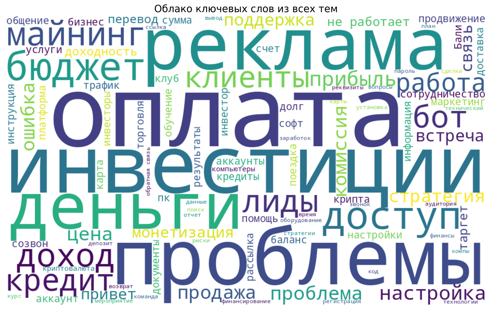

# ud83dudcdd Анализ личности на основе Telegram-чатов

## ud83dudce3 О чем вы говорите чаще всего?

На основе анализа ваших личных переписок в Telegram, мы выявили следующие основные категории тем и интересов. Эти данные помогают составить уникальный профиль вашей личности через призму общения.

### ud83cudf10 Распределение основных тем в ваших разговорах

Как видно из диаграммы, ваше общение вращается вокруг нескольких ключевых тематик. Эти темы формируют ваш цифровой образ и отражают сферы ваших интересов и компетенций.

### ud83dudd0d Ключевые слова из ваших диалогов

Это облако слов показывает термины и понятия, которые вы используете чаще всего. Размер слова прямо пропорционален частоте его появления в ваших чатах. Такая визуализация помогает быстро определить сферы ваших знаний и ключевые концепции, о которых вы говорите.

### ud83dude0e Эмоциональный профиль ваших обсуждений

Данная диаграмма отражает эмоциональный окрас ваших бесед по различным темам. Она показывает, какие сферы вызывают у вас позитивные эмоции, а какие - негативные или нейтральные. Такой анализ позволяет понять ваши предпочтения и потенциальные сферы стресса.

## ud83dudc64 Ваш личностный профиль

На основе анализа ваших чатов, можно выделить следующие черты вашей личности и интересов:

1. **Профессиональные интересы**: Вы активно обсуждаете темы, связанные с технологиями, маркетингом и монетизацией проектов, что говорит о вашей вовлеченности в эти сферы.

2. **Коммуникативный стиль**: В целом, ваше общение характеризуется деловым подходом с элементами неформального обмена идеями. Вы часто обсуждаете рабочие вопросы, но сохраняете дружелюбный тон.

3. **Эмоциональная окраска**: Большинство тем обсуждаются с нейтральным или позитивным оттенком, хотя финансовые вопросы и дедлайны могут вызывать негативные эмоции.

## ud83dudcb0 Потенциальные возможности для монетизации

Основываясь на выявленных темах и интересах, мы предлагаем следующие направления для потенциальной монетизации ваших знаний и навыков:

1. **Консультации по маркетингу и продвижению** - ваш опыт в этой сфере может быть ценен для начинающих предпринимателей

2. **Обучение техническим навыкам** - вы обладаете знаниями, которые можно трансформировать в курсы или тренинги

3. **Разработка стратегий монетизации** - ваше понимание бизнес-процессов может быть полезно для проектов на начальной стадии

## ud83dudcca Заключение

Этот анализ представляет собой цифровой портрет вашей личности через призму общения в Telegram. Он показывает, чем вы интересуетесь, как взаимодействуете с людьми и какой информацией обмениваетесь чаще всего.

Понимание собственных коммуникационных паттернов может помочь:

- Осознать свои сильные стороны и области для развития
- Выявить новые возможности для профессионального и личного роста
- Лучше понять свой коммуникативный стиль и его влияние на окружающих

---

*Этот отчет создан автоматически на основе анализа ваших Telegram-чатов с использованием технологий искусственного интеллекта. Все данные обрабатывались локально и конфиденциально.*
